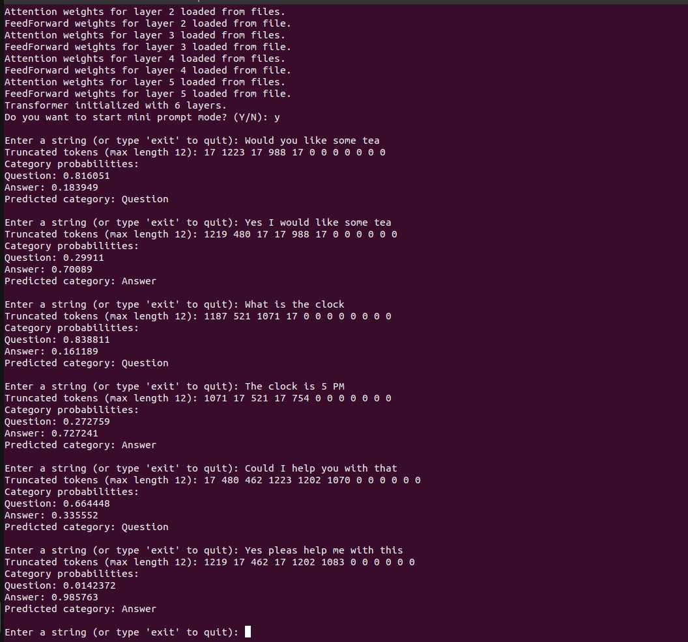

# Tutorial code for C/C++ Transformer "mini_transformer_cpp"

I have done lot's of tweeks to focus on understand this transformer algorithm in C/C++ perspective and also generate print outs and graphs down the road to understand the code and the transformer algorithm.

### Overview and purpose:
Transformer Test in Mini Format (C/C++) - No Use of ML Libraries. Just for my own tutorial proposal in the first hand but may enjoy other as well.

## mini prompt test if Question or Answer



### Description of the project:
Transformer Test in Mini Format (C/C++) - No Use of ML Libraries. The goal is to build and understand the Transformer algorithm from scratch using pure C++. Testing key components step by step...


## File structures
```
transformer_project/
├── src/
│   ├── main.cpp            # Entry point for the application
│   ├── config.cpp
│   ├── dataset.cpp         # Mini dataset toy example
│   ├── layer_normalization.cpp
│   ├── transformer.cpp     # Implementation of the Transformer
│   ├── attention.cpp       # Implementation of the attention mechanism
│   ├── feed_forward.cpp    # Implementation of the feed-forward network
│   ├── embedding.cpp       # Implementation of embeddings
│   ├── positional_encoding.cpp # Implementation of positional encoding
│   └── utils.cpp           # Helper functions
├── include/
│   ├── transformer.h
│   ├── config.h            # Contain preprocessor directives (Global preprocessor directives) and Global variables 
│   ├── attention.h
│   ├── dataset.h
│   ├── layer_normalization.h
│   ├── feed_forward.h
│   ├── embedding.h
│   ├── positional_encoding.h
│   └── utils.h
├── build/                  # Directory for compiled files
├── data/                   # Sample input data for testing
└── Makefile                # Build instructions
```
## Understand position encoder
Code:

        positional_encoding.h
        positional_encoding.cpp
        

Purpose of Positional Encoding

The purpose of the positional encoding is to inject information about the position of each token in the sequence. Transformers process sequences in parallel without inherent knowledge of token order, so positional encoding compensates for this.

Key Idea:

        pos_encoding[pos][i] 
        
stores the positional encoding for the i-th dimension of the pos-th token.
Sine (sin) and Cosine (cos) functions with varying frequencies are used to encode positions.


### "d_model" is like set the resolution of dimentions of distance measure 

```
    int d_model = 128; // The "resolution" of the positional encoding and embedding space. 
                    // Think of it like a meter stick with 128 evenly spaced lines: 
                    // this determines how finely the meaning of a token can be represented
                    // across multiple dimensions.
                    //
                    // Each token (word or sub-word) is not just an isolated entity but carries 
                    // a representation that heavily depends on its position and relationships 
                    // to other tokens in the context. For example, the word "bank" could 
                    // mean "riverbank" or "financial bank," and its meaning is influenced 
                    // by neighboring words.
                    //
                    // In this context, "d_model" defines the number of dimensions (features) 
                    // used to represent these relationships. Higher d_model provides a finer 
                    // "resolution," allowing the model to encode more complex interactions 
                    // and associations across the sequence. 
                    //
                    // Increasing d_model expands the range of nuances and relationships that 
                    // the model can capture, enabling it to differentiate subtle differences 
                    // in meaning based on positional and contextual variations in the input 
                    // sequence.
                    //
                    // However, higher d_model also increases computational complexity and 
                    // the risk of overfitting for small datasets, so a balance is needed.
```

## Position encoder initialized vector values

Example printout of sin
```
for (int pos = 0; pos < max_len; ++pos)
    {
        for (int i = 0; i < d_model; ++i)
        {
        ....
pos = tokens position
i = dimentions
pos_encoding[pos][i]

example pos 0 and 1
sin pos_encoding[0][122]: 0
sin pos_encoding[0][124]: 0
sin pos_encoding[0][126]: 0
sin pos_encoding[1][0]: 0.841471
sin pos_encoding[1][2]: 0.76172
sin pos_encoding[1][4]: 0.681561
```

I was plot the initialized values of pos_encoding[pos][i] to show a plot what the contructor doing.
### Plot the sin initilized vector
Use the octave to plot sin.dat file
example data:
```
0 0 0
0 2 0
0 4 0
0 6 0
...
0 122 0
0 124 0
0 126 0
1 0 0.841471
1 2 0.76172
1 4 0.681561
...
1 122 0.000153993
1 124 0.000133352
1 126 0.000115478
2 0 0.909297
2 2 0.987046
2 4 0.99748
```

#### all dimentions sin

#### sin dim 0 2 4


### Plot the cos initilized vector
Use the octave to plot cos.dat file
example data:
```
0 1 1
0 3 1
0 5 1
...
0 125 1
0 127 1
1 1 0.540302
1 3 0.647906
...
1 123 1
1 125 1
1 127 1
2 1 -0.416147
2 3 -0.160436
2 5 0.0709483
```
#### all dimentions cos

#### cos dim 1 3 5


## Embedding_matrix
Code: 

        embedding.h
        embedding.cpp

### 1. Purpose of embedding_matrix

The embedding_matrix serves as a lookup table for mapping each token ID (integer) to a high-dimensional vector of size d_model.

vocab_size (Rows):
Each row corresponds to a unique token in the vocabulary.
Example: If "The" has token ID 42, row 42 of the embedding matrix contains the vector representation of "The".

d_model (Columns):
Each column in the row represents one dimension of the token's embedding.
Example: If d_model = 128, each token is represented as a 128-dimensional vector.

### 2. What the Code Does

        embedding_matrix = std::vector<std::vector<float>>(vocab_size, std::vector<float>(d_model));

This code:
Creates a 2D vector:
The outer vector has vocab_size rows (5000 in your case).
Each row is an inner vector of size d_model (128 in your example).

Initializes All Values to Zero:
By default, all elements in the matrix are initialized to 0.0.

### Example

#### 1. Let’s assume:

            vocab_size = 3 (3 tokens in the vocabulary).
            d_model = 4 (4-dimensional embeddings).
#### 2. Initial matrix:

```
embedding_matrix = std::vector<std::vector<float>>(3, std::vector<float>(4));

embedding_matrix = [
    [0.0, 0.0, 0.0, 0.0],  // Token 0
    [0.0, 0.0, 0.0, 0.0],  // Token 1
    [0.0, 0.0, 0.0, 0.0]   // Token 2
];
```
#### 3. Can Be Updated with Random or Learned Values:

Later, this matrix is either:
Initialized with random values (during training).
Filled with pre-trained embeddings (e.g., Word2Vec or GloVe).


Suppose we update it with random values:
```
embedding_matrix = [
    [0.12, 0.34, -0.56, 0.78],  // Token 0
    [0.91, -0.45, 0.67, -0.23], // Token 1
    [0.05, 0.14, -0.32, 0.89]   // Token 2
];

```
  
#### 4. How It Works During a Forward Pass

4.1 Input Tokens (IDs):
A sentence like "The cat sat" is tokenized into IDs (e.g., [42, 18, 87]).

4.2 Lookup in the Embedding Matrix:
For each token ID, the corresponding row in embedding_matrix is retrieved:
```
Token ID 42 → Row 42 (vector for "The").
Token ID 18 → Row 18 (vector for "cat").
Token ID 87 → Row 87 (vector for "sat").
```

4.3 Result:
A 2D vector is created where:
Rows correspond to tokens in the input sequence.
Columns correspond to the embedding dimensions (d_model).

### Summary

        vocab_size 

defines the number of rows in the matrix, representing the number of unique tokens the model can understand.
        
        d_model 

defines the number of columns, representing the size of each token's embedding vector.
The matrix acts as a lookup table, converting token IDs into dense vector representations.

## attention class
The center of the tranformer seem to be the attention block for in my view. It's lot of matrix multiplication used here.

I was made a print out test of one single attention layer with one single attention head.
You can "un-comment" the line

        #define PRINT_OUT_TEST_ATTENTION_FORWARD_OPERATION

at

        config.h

To enable this test print out of attention mechanism:

```
==================== Test: Single Attention Layer ====================
Matrix sizes are valid.
The resolution of the positional encoding and embedding space, d_model: 4
Attention weights for layer 0 initialized with random values.
Randomized attention weights for layer 0 saved to files.

=== Relationship Between d_model, num_heads, and Matrix Dimensions ===
d_model (total embedding dimension): 4
num_heads (number of attention heads): 1
d_k (key/query dimension per head): 4
d_v (value dimension per head): 4

Explanation:
- The total embedding dimension (d_model) is divided among all attention heads.
- With num_heads = 1, each head gets the full d_model, so d_k = d_model / num_heads = 4.
- Similarly, d_v = d_model / num_heads = 4.
In this case, each token is represented with 4 dimensions in Q and K, and 4 dimensions in V.

=== Hard coded Test Input Matrices ===

Input Q (Query):
[
  [1.0000, 0.5000, 0.1000, 0.0100]
  [0.2000, 1.3000, 0.2000, 0.0200]
  [1.2000, 2.3000, 3.2000, 4.1100]
]
Each row represents a token, and each column represents one of the 4 dimensions of the query vector.

Input K (Key):
[
  [0.8000, 0.3000, 0.3000, 0.0300]
  [0.1000, 0.9000, 0.4000, 0.0400]
  [0.2000, 0.3000, 3.0000, 1.1100]
]
Each row represents a token, and each column represents one of the 4 dimensions of the key vector.

Input V (Value):
[
  [1.2000, 0.7000, 0.5000, 0.0500]
  [0.5000, 0.4000, 0.6000, 0.0600]
  [2.2000, 1.3000, 0.0000, 3.1100]
]
Each row represents a token, and each column represents one of the 4 dimensions of the value vector.

Summary:
- Q and K have 4 columns because they encode positional and content-related similarities.
- V has 4 columns because it contains the actual token content to be weighted and combined.
=====================================================================

=== Scaled Dot-Product Attention Debug Output ===

Step 1: Compute QK^T
Query (Q) matrix (shape: 3 x 4):
[
  [1.0000, 0.5000, 0.1000, 0.0100]
  [0.2000, 1.3000, 0.2000, 0.0200]
  [1.2000, 2.3000, 3.2000, 4.1100]
]
Key (K) matrix (shape: 3 x 4):
[
  [0.8000, 0.3000, 0.3000, 0.0300]
  [0.1000, 0.9000, 0.4000, 0.0400]
  [0.2000, 0.3000, 3.0000, 1.1100]
]
QK^T (scores matrix, shape: 3 x 3):
[
  [0.9803, 0.5904, 0.6611]
  [0.6106, 1.2708, 1.0522]
  [2.7333, 3.6344, 15.0921]
]
Each element in this matrix represents the dot product similarity between a query vector (row) and a key vector (column).
For example:
  - scores[0][0] = dot product of Q[0] and K[0] (similarity between token 1's query and token 1's key).
  - scores[0][1] = dot product of Q[0] and K[1] (similarity between token 1's query and token 2's key).
  - scores[1][2] = dot product of Q[1] and K[2] (similarity between token 2's query and token 3's key).
Each row represents the similarity of a specific token's query with all tokens' keys, and each column represents the similarity of all queries with a specific token's key.

Step 2: Scale scores by sqrt(d_k)
Scaling factor (sqrt(d_k)): 2.0000
Scaled scores matrix:
[
  [0.4902, 0.2952, 0.3306]
  [0.3053, 0.6354, 0.5261]
  [1.3667, 1.8172, 7.5461]
]
Each score is scaled to adjust for the dimensionality of the key vectors.

Step 3: Apply masking to prevent attending to future tokens
Masked scores matrix:
[
  [0.4902, -inf, -inf]
  [0.3053, 0.6354, -inf]
  [1.3667, 1.8172, 7.5461]
]
This matrix shows the scores after applying a mask to ensure that a token only attends to itself and earlier tokens.

Step 4: Apply softmax to scores
Softmax applied (attention weights):
[
  [1.0000, 0.0000, 0.0000]
  [0.4182, 0.5818, 0.0000]
  [0.0021, 0.0032, 0.9947]
]
Each row represents the attention distribution for a token. The values sum to 1, showing how much each token attends to other tokens.

Step 5: Multiply scores with Value (V) matrix
Value (V) matrix (shape: 3 x 4):
[
  [1.2000, 0.7000, 0.5000, 0.0500]
  [0.5000, 0.4000, 0.6000, 0.0600]
  [2.2000, 1.3000, 0.0000, 3.1100]
]
Output matrix (shape: 3 x 4):
[
  [1.2000, 0.7000, 0.5000, 0.0500]
  [0.7928, 0.5255, 0.5582, 0.0558]
  [2.1924, 1.2959, 0.0030, 3.0938]
]
Each row in the output matrix corresponds to the weighted sum of value vectors for each token, based on its attention distribution.
=== End of Debug Output ===
=====================================================================

```
## Example log when training 

```

Average Loss for Epoch 258: 0.354806
Epoch 259 / 1000
** correct_prob : 0.855
Average Loss for Epoch 259: 0.352544
Epoch 260 / 1000
** correct_prob : 0.855
Average Loss for Epoch 260: 0.356734
Epoch 261 / 1000
** correct_prob : 0.855
Average Loss for Epoch 261: 0.356308
Epoch 262 / 1000
** correct_prob : 0.855
Average Loss for Epoch 262: 0.350175
Epoch 263 / 1000
** correct_prob : 0.8625
Final layer weights saved to final_layer_weight.bin.
Embedding matrix saved to file: embedding_matrix.bin
Attention weights for layer 0 saved to files.
Attention weights for layer 1 saved to files.
Attention weights for layer 2 saved to files.
Attention weights for layer 3 saved to files.
Attention weights for layer 4 saved to files.
Attention weights for layer 5 saved to files.
FeedForward weights for layer 0 initialized and saved to file.
FeedForward weights for layer 1 initialized and saved to file.
FeedForward weights for layer 2 initialized and saved to file.
FeedForward weights for layer 3 initialized and saved to file.
FeedForward weights for layer 4 initialized and saved to file.
FeedForward weights for layer 5 initialized and saved to file.
Average Loss for Epoch 263: 0.330319
Epoch 264 / 1000
** correct_prob : 0.8775
Average Loss for Epoch 264: 0.350765
Epoch 265 / 1000
** correct_prob : 0.86
Average Loss for Epoch 265: 0.369768
Epoch 266 / 1000
** correct_prob : 0.865
Average Loss for Epoch 266: 0.362699
Epoch 267 / 1000
** correct_prob : 0.8775
Average Loss for Epoch 267: 0.342921
Epoch 268 / 1000
** correct_prob : 0.8875
Average Loss for Epoch 268: 0.335516
Epoch 269 / 1000
** correct_prob : 0.8725
Average Loss for Epoch 269: 0.344732

```


