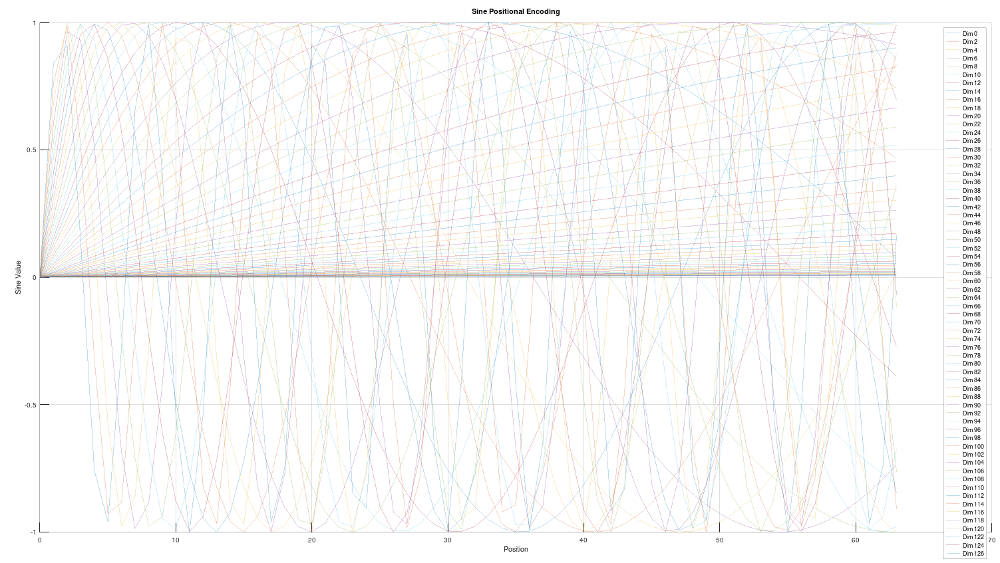
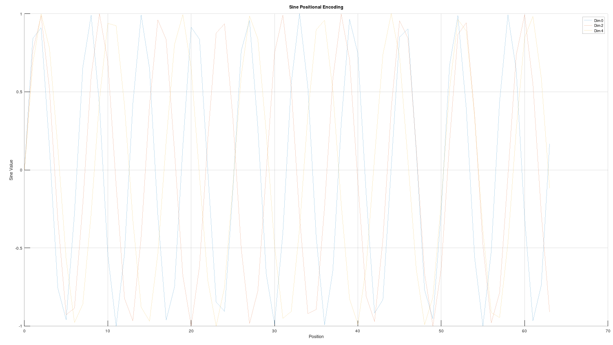
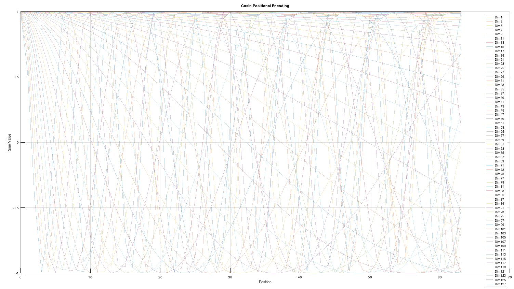
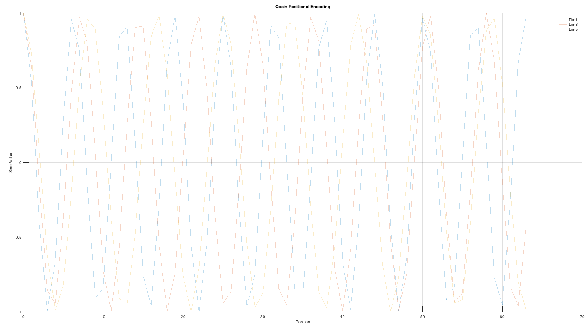

# Tutorial code for C/C++ Transformer "mini_transformer_cpp"
## Note code AI-powered assistance:
This code is inspired by AI-powered assistance

### Overview and purpose:
Transformer Test in Mini Format (C/C++) - No Use of ML Libraries. Just for my own tutorial proposal in the first hand but may enjoy other as well.

### Description of the project:
Transformer Test in Mini Format (C/C++) - No Use of ML Libraries. This mini Transformer project is heavily guided and inspired by AI-powered assistance (Transformer LLM). The goal is to build and understand the Transformer algorithm from scratch using pure C++. Testing key components step by step...


## File structures
```
transformer_project/
├── src/
│   ├── main.cpp            # Entry point for the application
│   ├── transformer.cpp     # Implementation of the Transformer
│   ├── attention.cpp       # Implementation of the attention mechanism
│   ├── feed_forward.cpp    # Implementation of the feed-forward network
│   ├── embedding.cpp       # Implementation of embeddings
│   ├── positional_encoding.cpp # Implementation of positional encoding
│   └── utils.cpp           # Helper functions
├── include/
│   ├── transformer.h
│   ├── attention.h
│   ├── feed_forward.h
│   ├── embedding.h
│   ├── positional_encoding.h
│   └── utils.h
├── build/                  # Directory for compiled files
├── data/                   # Sample input data for testing
└── Makefile                # Build instructions
```
## Understand position encoder
Code:

        positional_encoding.h
        positional_encoding.cpp
        

Purpose of Positional Encoding

The purpose of the positional encoding is to inject information about the position of each token in the sequence. Transformers process sequences in parallel without inherent knowledge of token order, so positional encoding compensates for this.

Key Idea:

        pos_encoding[pos][i] 
        
stores the positional encoding for the i-th dimension of the pos-th token.
Sine (sin) and Cosine (cos) functions with varying frequencies are used to encode positions.


### "d_model" is like set the resolution of the measure 

```
    int d_model = 128; // The "resolution" of the positional encoding and embedding space. 
                    // Think of it like a meter stick with 128 evenly spaced lines: 
                    // this determines how finely the meaning of a token can be represented
                    // across multiple dimensions.
                    //
                    // Each token (word or sub-word) is not just an isolated entity but carries 
                    // a representation that heavily depends on its position and relationships 
                    // to other tokens in the context. For example, the word "bank" could 
                    // mean "riverbank" or "financial bank," and its meaning is influenced 
                    // by neighboring words.
                    //
                    // In this context, "d_model" defines the number of dimensions (features) 
                    // used to represent these relationships. Higher d_model provides a finer 
                    // "resolution," allowing the model to encode more complex interactions 
                    // and associations across the sequence. 
                    //
                    // Increasing d_model expands the range of nuances and relationships that 
                    // the model can capture, enabling it to differentiate subtle differences 
                    // in meaning based on positional and contextual variations in the input 
                    // sequence.
                    //
                    // However, higher d_model also increases computational complexity and 
                    // the risk of overfitting for small datasets, so a balance is needed.
```

## Position encoder initialized vector values
Example printout of sin
```
for (int pos = 0; pos < max_len; ++pos)
    {
        for (int i = 0; i < d_model; ++i)
        {
        ....
pos = tokens position
i = dimentions
pos_encoding[pos][i]

example pos 0 and 1
sin pos_encoding[0][122]: 0
sin pos_encoding[0][124]: 0
sin pos_encoding[0][126]: 0
sin pos_encoding[1][0]: 0.841471
sin pos_encoding[1][2]: 0.76172
sin pos_encoding[1][4]: 0.681561
```

I was plot the initialized values of pos_encoding[pos][i] to show a plot what the contructor doing.
### Plot the sin initilized vector
Use the octave to plot sin.dat file
example data:
```
0 0 0
0 2 0
0 4 0
0 6 0
...
0 122 0
0 124 0
0 126 0
1 0 0.841471
1 2 0.76172
1 4 0.681561
...
1 122 0.000153993
1 124 0.000133352
1 126 0.000115478
2 0 0.909297
2 2 0.987046
2 4 0.99748
```

#### all dimentions sin

#### sin dim 0 2 4


### Plot the cos initilized vector
Use the octave to plot cos.dat file
example data:
```
0 1 1
0 3 1
0 5 1
...
0 125 1
0 127 1
1 1 0.540302
1 3 0.647906
...
1 123 1
1 125 1
1 127 1
2 1 -0.416147
2 3 -0.160436
2 5 0.0709483
```
#### all dimentions cos

#### cos dim 1 3 5



## Embedding_matrix
Code: 

        embedding.h
        embedding.cpp

### 1. Purpose of embedding_matrix

The embedding_matrix serves as a lookup table for mapping each token ID (integer) to a high-dimensional vector of size d_model.

vocab_size (Rows):
Each row corresponds to a unique token in the vocabulary.
Example: If "The" has token ID 42, row 42 of the embedding matrix contains the vector representation of "The".

d_model (Columns):
Each column in the row represents one dimension of the token's embedding.
Example: If d_model = 128, each token is represented as a 128-dimensional vector.

### 2. What the Code Does

        embedding_matrix = std::vector<std::vector<float>>(vocab_size, std::vector<float>(d_model));

This code:
Creates a 2D vector:
The outer vector has vocab_size rows (5000 in your case).
Each row is an inner vector of size d_model (128 in your example).

Initializes All Values to Zero:
By default, all elements in the matrix are initialized to 0.0.

### Example

#### 1. Let’s assume:

            vocab_size = 3 (3 tokens in the vocabulary).
            d_model = 4 (4-dimensional embeddings).
#### 2. Initial matrix:

```
embedding_matrix = std::vector<std::vector<float>>(3, std::vector<float>(4));

embedding_matrix = [
    [0.0, 0.0, 0.0, 0.0],  // Token 0
    [0.0, 0.0, 0.0, 0.0],  // Token 1
    [0.0, 0.0, 0.0, 0.0]   // Token 2
];
```
#### 3. Can Be Updated with Random or Learned Values:

Later, this matrix is either:
Initialized with random values (during training).
Filled with pre-trained embeddings (e.g., Word2Vec or GloVe).


Suppose we update it with random values:
```
embedding_matrix = [
    [0.12, 0.34, -0.56, 0.78],  // Token 0
    [0.91, -0.45, 0.67, -0.23], // Token 1
    [0.05, 0.14, -0.32, 0.89]   // Token 2
];

```
  
#### 4. How It Works During a Forward Pass

4.1 Input Tokens (IDs):
A sentence like "The cat sat" is tokenized into IDs (e.g., [42, 18, 87]).

4.2 Lookup in the Embedding Matrix:
For each token ID, the corresponding row in embedding_matrix is retrieved:
```
Token ID 42 → Row 42 (vector for "The").
Token ID 18 → Row 18 (vector for "cat").
Token ID 87 → Row 87 (vector for "sat").
```

4.3 Result:
A 2D vector is created where:
Rows correspond to tokens in the input sequence.
Columns correspond to the embedding dimensions (d_model).

### Summary

        vocab_size 

defines the number of rows in the matrix, representing the number of unique tokens the model can understand.
        
        d_model 

defines the number of columns, representing the size of each token's embedding vector.
The matrix acts as a lookup table, converting token IDs into dense vector representations.


